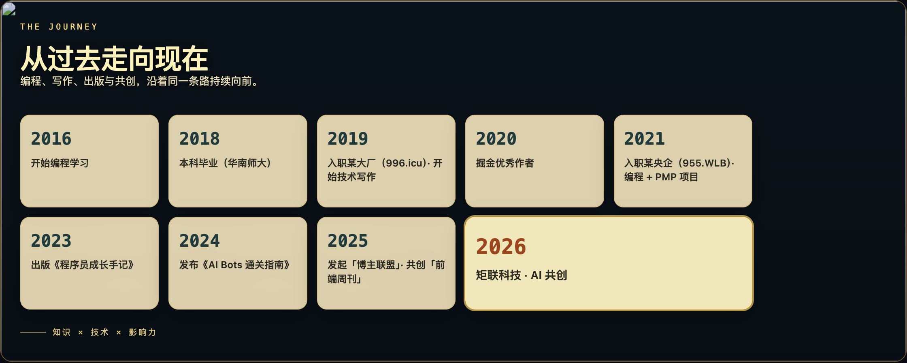

<h1 align="center">👋 你好，我是涂阿燃（TUARAN）</h1>

  社区ID：<a href="https://juejin.cn/user/1521379823340792">掘金安东尼</a> ｜ <a href="https://www.xiaohongshu.com/user/profile/68b313f9000000001901d07e">安东尼404</a> ｜ <a href="https://blog.csdn.net/aifs2025">安东尼与AI</a>

  <code>FDE</code> · <code>KOL</code> · <code>矩联科技创始人</code>

  <a href="./README.en.md">🇺🇸 English Version</a>

  AI 前沿部署工程师、社区 KOL 与矩联科技创始人。 
  研究与交付 AI Agent，著有《程序员成长手记》《AI Bots 通关指南》，<a href="https://github.com/openclaw/openclaw/pulls?q=is%3Apr+author%3ATUARAN+is%3Amerged">6 个 OpenClaw PR</a> 已合并至 main。

---

## 🪪 我现在主要在做什么

写代码、研究 AI Agent、维护社区，也做产品和商业项目。FDE、KOL 与矩联科技，分别对应工程实践、社区创作和公司业务。

| 身份 | 说明 |
| :--- | :--- |
| **FDE · AI 前沿部署工程师** | 研究 AI Agent、模型工具协议与上下文工程，也把这些能力接进真实产品。从原型到部署、鉴权、测试和维护，最后看它能不能稳定解决问题。 |
| **KOL · 社区 KOL** | 长期写技术文章、做社区分享，也参与开源协作。把亲手做过的事情讲清楚，说明哪些工具好用、哪些判断还要再等等。 |
| **MatrixLink · 矩联科技** | 围绕 AI 开发者生态、创作者协作与技术服务建设矩联科技，把工程经验、内容与社区连接落到可交付的站点、产品与服务中。 |

---

## 📊 一些数字

| 1500+ | 600w+ | 2 | 6 | 6 | 2016 |
| :---: | :---: | :---: | :---: | :---: | :---: |
| 公开内容 / 发帖 | 全网阅读 | 出版作品 | 在维护站点 | OpenClaw 合并 PR | 起步至今 |

---

## 📅 关于我

  

<pre>
2016 ── 开始编程学习
  │
2018 ── 本科毕业<a href="https://www.scnu.edu.cn/">（华南师大）</a>
  │
2019 ── 入职某大厂<a href="https://996.ICU/#/">（996.ICU）</a> · 开始技术写作
  │
2020 ── <a href="https://juejin.cn/user/1521379823340792">掘金优秀作者</a>
  │
2021 ── 入职某央企<a href="https://github.com/formulahendry/955.WLB">（955.WLB）</a> · 编程 + PMP 项目
  │
2023 ── 出版<a href="https://www.dedao.cn/ebook/detail?id=Lk89Yv4kyM12eaG795DmKAponOvLVWvoRl83ZzdbYxN84JQR6XgEqBPljrbpzARl">《程序员成长手记》</a>
  │
2024 ── 发布<a href="https://juejin.cn/book/7351709145294176282">《AI Bots 通关指南》</a>
  │
2025 ── 发起<a href="https://blogger-alliance.cn">「博主联盟」</a> · 共创<a href="https://weekly.2aran.com/">「前端周刊」</a>
  │
2026 ── <a href="https://matrixlink.tech">矩联科技</a> · AI 共创
</pre>

|    项目    | 信息 | 说明 |
| :---------: | :--- | :--- |
|   🌐 主页   | [2aran.com](https://2aran.com) ｜ [关于我](https://2aran.com/about) | 个人主页、技术笔记与长期内容索引 |
| 💬 联系方式 | 微信 `atar24` ｜ [tuaran666@gmail.com](mailto:tuaran666@gmail.com) | 交流 / 合作 |
|  📊 影响力  | [1500+ 公开内容，全网阅读 600 万+](https://csdn-fans-tracker.pages.dev/) | 输入决定输出 |
| 🔗 社交平台 | [掘金](https://juejin.cn/user/1521379823340792) ｜ [小红书](https://www.xiaohongshu.com/user/profile/68b313f9000000001901d07e) ｜ [CSDN](https://blog.csdn.net/aifs2025) ｜ [51CTO](https://blog.51cto.com/u_15298598) ｜ [GitHub](https://github.com/TUARAN) | 技术写作 / 社区共建 / 开源协作 |

---

## 🧩 Open Source · 开源贡献

截至 2026 年 8 月，共有 **6** 个由 TUARAN 提交的 Pull Request 合并至 [`openclaw:main`](https://github.com/openclaw/openclaw/pulls?q=is%3Apr+author%3ATUARAN+is%3Amerged)，并明确关联关闭 5 个 issue（[#113143](https://github.com/openclaw/openclaw/issues/113143)、[#102323](https://github.com/openclaw/openclaw/issues/102323)、[#42798](https://github.com/openclaw/openclaw/issues/42798)、[#98311](https://github.com/openclaw/openclaw/issues/98311)、[#83277](https://github.com/openclaw/openclaw/issues/83277)）。

| PR | 内容 | 关联 Issue |
| :---: | :--- | :---: |
| [#120104](https://github.com/openclaw/openclaw/pull/120104) | 限制错误入站消息的重试次数 | [#108865](https://github.com/openclaw/openclaw/issues/108865) |
| [#113200](https://github.com/openclaw/openclaw/pull/113200) | Doctor 尊重自定义插件加载路径 | [#113143](https://github.com/openclaw/openclaw/issues/113143) |
| [#102537](https://github.com/openclaw/openclaw/pull/102537) | Anthropic 内联图片格式规范化 | [#102323](https://github.com/openclaw/openclaw/issues/102323) |
| [#91553](https://github.com/openclaw/openclaw/pull/91553) | Tailscale Serve 启动状态重试 | [#42798](https://github.com/openclaw/openclaw/issues/42798) |
| [#98320](https://github.com/openclaw/openclaw/pull/98320) | Feishu 媒体回复回退 | [#98311](https://github.com/openclaw/openclaw/issues/98311) |
| [#90517](https://github.com/openclaw/openclaw/pull/90517) | Web Login 插件缺失提示 | [#83277](https://github.com/openclaw/openclaw/issues/83277) |

---

## 📚 书籍 / 电子册出版

About 页只统计已完成的两项作品；完整进度见 [2aran.com/publications](https://2aran.com/publications)。

| # | 书籍 / 专题名称 | 分类 | 时间 | 状态 |
| :-: | :--- | :---: | :---: | :---: |
| 1 | [《程序员成长手记》](https://www.dedao.cn/ebook/detail?id=Lk89Yv4kyM12eaG795DmKAponOvLVWvoRl83ZzdbYxN84JQR6XgEqBPljrbpzARl) | 📖 技术图书 | 2022–2023 | ✅ 已出版 |
| 2 | [《AI Bots 通关指南》](https://juejin.cn/book/7351709145294176282) | 📱 电子小册 | 2024 | ✅ 已发布 |
| 3 | 《5 小时吃透大模型》 | 📖 技术图书 | 2024–2025 | 📤 已交稿 · 出版中 |
| 4 | 《智能体实战（扣子 · n8n · Dify）》 | 📖 联合创作 | 2025–2026 | 📝 撰写中 |
| 5 | 《Seedance 2.0 电影级 AI 视频创作指南》 | 📖 联合创作 | 2026 上半年 | 📤 已交稿 · 出版中 |
| 6 | 《具身智能》 | 📖 技术图书 | 2025 立项 | 📝 立项中 |

---

## 🌐 正在维护的站点

个人主页与 [2aran.com](https://2aran.com) 子站，对应 About 页当前在维护的公开站点。

| 名称 | 域名 | 定位 |
| :--- | :--- | :--- |
| **TUARAN 网络日志** | [2aran.com](https://2aran.com) | 个人主页、技术笔记与长期内容索引 |
| **前端周看** | [weekly.2aran.com](https://weekly.2aran.com/) | 前端、AI Agent 与大模型工程周刊 |
| **AI 分发大师** | [syncblog.2aran.com](https://syncblog.2aran.com/) | Markdown 编辑、草稿管理与多平台分发 |
| **从夯到拉** | [rank.2aran.com](https://rank.2aran.com/) | 一份可以自己拖、自己改的 AI 产品分级榜 |
| **GPT Plus 充值** | [gptplus.2aran.com](https://gptplus.2aran.com/) | ChatGPT Plus 与 Pro 订阅充值服务 |
| **阿燃诗词** | [poemcn.2aran.com](https://poemcn.2aran.com/) | 按诗名、作者和诗句查找古诗词与文言文 |
| **WorkBuddy 资源库** | [workbuddy.2aran.com](https://workbuddy.2aran.com/) | WorkBuddy 案例、教程、Prompt 模板与自动化实战 |

---

## 🏗 发起项目 & 工具箱

| # | 项目 / 工具 | 简介 | 仓库地址 | 网页地址 | 类型 | 状态 |
| :-: | :--- | :--- | :---: | :---: | :---: | :---: |
| 1 | 🤝 **博主联盟** | 连接 AI 产品与技术影响力 | [GitHub](https://github.com/TUARAN/blogger-alliance) | [传送门](https://blogger-alliance.cn) | 开源项目 | 🟢 运营中 |
| 2 | 🧭 **前端下一步** | 帮前端工程师在 AI 时代做技术转向判断 | [GitHub](https://github.com/TUARAN/frontend-weekly-digest-cn) | [传送门](https://frontendnext.com/) | 开源项目 | 🟢 运营中 |
| 3 | 🔥 安东尼学AI | AI 学习资料整理与分享 | [GitHub](https://github.com/TUARAN/AI-Learning-Library) | [传送门](https://matrix-ai-pdfs.pages.dev/) | 工具站 | 🟢 已上线 |
| 4 | 🎨 Banana Gallery | 创意图库工具 | [GitHub](https://github.com/TUARAN/Awesome-Nano-Banana-images) | [传送门](https://banana-gallery.pages.dev/) | 工具站 | 🟢 已上线 |
| 5 | 💡 提示词工程 | Prompt Engineering 实践参考 | [GitHub](https://github.com/TUARAN/awesome-prompt) | [传送门](https://awesome-prompt-seven.vercel.app/) | 工具站 | 🟢 已上线 |
| 6 | 🛠 代码矿工 | 开发者效率工具集 | [GitHub](https://github.com/TUARAN/toolkit-hub) | [传送门](https://toolkit-hub.pages.dev/) | 工具站 | 🟢 已上线 |
| 7 | 🧠 Claude Code Unpacked | 交互式拆解 Claude Code 的 Agent 循环与工具系统 | [GitHub](https://github.com/TUARAN/ccunpacked-zh) | [传送门](https://ccunpacked-zh.pages.dev/) | 工具站 | 🟢 已上线 |
| 8 | 🧪 WebLLM | 基于 WebGPU 的浏览器侧大模型实验 | [GitHub](https://github.com/TUARAN/webllm) | [传送门](https://2aran.com/web-llm) | 实验项目 | 🟢 已上线 |

---

## 🧭 站点矩阵

| 名称 | 域名 | 类型 | 核心定位 |
| :--- | :--- | :--- | :--- |
| 🧑‍💻 **TUARAN** | [https://2aran.com](https://2aran.com) | 个人品牌 | 个人技术主页 · AI × 工程 × 思考 |
| 🚀 **MatrixLink** | [https://matrixlink.tech](https://matrixlink.tech) | 公司官网 | 广州矩联科技主页 · 矩阵联合，共创共赢 |
| 🤝 **Blogger Alliance** | [https://blogger-alliance.cn](https://blogger-alliance.cn) | 推广服务 | 技术博主联盟与技术产品推广 |
| 🧭 **前端下一步 Frontend Next** | [https://frontendnext.com](https://frontendnext.com) | 转型决策 | 帮前端工程师在 AI 时代做技术转向判断 |
| 🤖 **I Am Vibe Coder** | [https://iamvibecoder.cn](https://iamvibecoder.cn) | 社区平台 | AI 编程交流与开发者共创社区 |
| 🧠 **Open Claude Code** | [https://openclaudecode.site](https://openclaudecode.site) | 学习站 | 系统拆解 Claude Code 的 Agent 循环与多智能体协作 |
| ✍️ **PublishLab** | [https://publishlab.cc](https://publishlab.cc) | 创作实验室 | AI 写作、内容创作与数字出版 |
| ⚡ **Frontend 2 AI Agent** | [https://frontend2aiagent.com](https://frontend2aiagent.com) | 转型平台 | 前端工程师转向 AI Agent 工程师的成长路径 |

---

## ⚙️ 技术栈 & 关注领域

| 能力层级 | 技术领域 | 核心技术 | 延伸能力 | 工程定位 |
| :--- | :--- | :--- | :--- | :--- |
| **基础语言层** | 编程语言 | JavaScript · TypeScript · Python · Rust | 多语言协同开发 | 全栈工程基础 |
| **前端工程层** | Web 应用构建 | Vue 3 · Vite · TailwindCSS · ECharts | 数据可视化 · 交互系统 | AI 应用界面承载 |
| **AI 能力层** | 大模型应用 | LLM · Agent · MCP · OpenClaw | Local Inference · 多模型调度 | 智能体核心引擎 |
| **系统工程层** | 后端与运行环境 | Node.js · Flask · SQLite · Docker · Tauri | 本地应用 · 桌面化部署 | AI Native Infra |
| **架构关注层** | 技术方向 | LLM Application Engineering | Agent Orchestration | MCP Workflow · 自动化研发 · AI Native Software |

---

## 🧭 工程理念

> *系统优先 · 自动化优先 · 长期可复用 · 减少人工依赖*
>
> 我倾向构建能够长期稳定运行的系统，而非一次性工具。

---

  <i>✨ 高山流水觅知音，邀君并肩共前行。</i>

  <a href="https://2aran.com">🌐 2aran.com</a> ·
  <a href="https://2aran.com/about">👤 关于我</a> ·
  <a href="mailto:tuaran666@gmail.com">📧 Email</a> ·
  <a href="https://weekly.2aran.com/">📅 前端周看</a>

