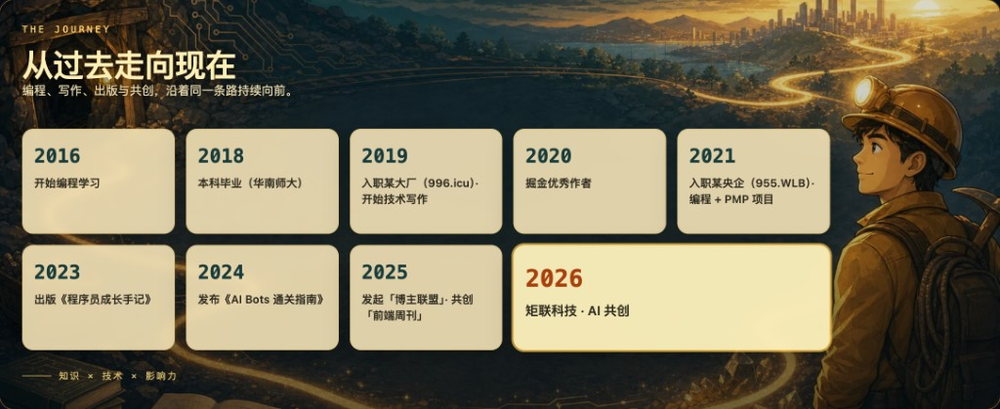

<p align="center">
  
</p>

<h1 align="center">👋 你好，我是涂阿燃（TUARAN）</h1>

<p align="center">
  <a href="https://juejin.cn/user/1521379823340792">掘金安东尼</a> · <a href="https://www.xiaohongshu.com/user/profile/68b313f9000000001901d07e">安东尼404</a> · <a href="https://blog.csdn.net/aifs2025">安东尼与AI</a>
  &nbsp;|&nbsp;
  <code>FDE</code> · <code>KOL</code> · <code>矩联科技创始人</code>
  &nbsp;|&nbsp;
  <a href="./README.en.md">English</a>
</p>

<p align="center">
  AI 前沿部署工程师、社区 KOL 与矩联科技创始人。<br />
  研究与交付 AI Agent，著有《程序员成长手记》《AI Bots 通关指南》，<a href="https://github.com/openclaw/openclaw/pulls?q=is%3Apr+author%3ATUARAN+is%3Amerged">6 个 OpenClaw PR</a> 已合并至 main。
</p>

<p align="center">
  <strong>1500+</strong> 公开内容 ·
  <strong>600w+</strong> 阅读 ·
  <strong>2</strong> 出版作品 ·
  <strong>6</strong> 在维护站点 ·
  <strong>6</strong> OpenClaw PR ·
  <strong>2016</strong> 起步
</p>

## 目录

- [关于我](#关于我)
- [出版作品](#出版作品)
- [开源贡献](#开源贡献)
- [站点与项目](#站点与项目)
- [技术栈](#技术栈)
- [联系](#联系)

---

## 关于我

写代码、研究 AI Agent、维护社区，也做产品和商业项目。FDE、KOL 与矩联科技，分别对应工程实践、社区创作和公司业务。完整介绍：[2aran.com/about](https://2aran.com/about)

| FDE · AI 前沿部署工程师 | KOL · 社区创作 | MatrixLink · 矩联科技 |
| :--- | :--- | :--- |
| 研究 AI Agent、模型工具协议与上下文工程，从原型接到部署、鉴权、测试和维护，看它能不能稳定解决问题。 | 长期写技术文章、做社区分享，也参与开源协作。把亲手做过的事情讲清楚。 | 围绕 AI 开发者生态、创作者协作与技术服务建设矩联科技，把经验落到可交付的站点、产品与服务。 |

### 时间线

```
2016  开始编程学习
2018  本科毕业（华南师大）
2019  入职某大厂（996.ICU）· 开始技术写作
2020  掘金优秀作者
2021  入职某央企（955.WLB）· 编程 + PMP 项目
2023  出版《程序员成长手记》
2024  发布《AI Bots 通关指南》
2025  发起「博主联盟」· 共创「前端周刊」
2026  矩联科技 · AI 共创
```

---

## 出版作品

About 页统计已完成的两项；完整进度见 [2aran.com/publications](https://2aran.com/publications)。

| 作品 | 类型 | 时间 | 状态 |
| :--- | :---: | :---: | :---: |
| [《程序员成长手记》](https://www.dedao.cn/ebook/detail?id=Lk89Yv4kyM12eaG795DmKAponOvLVWvoRl83ZzdbYxN84JQR6XgEqBPljrbpzARl) | 技术图书 | 2022–2023 | ✅ 已出版 |
| [《AI Bots 通关指南》](https://juejin.cn/book/7351709145294176282) | 电子小册 | 2024 | ✅ 已发布 |
| 《5 小时吃透大模型》 | 技术图书 | 2024–2025 | 📤 已交稿 · 出版中 |
| 《智能体实战（扣子 · n8n · Dify）》 | 联合创作 | 2025–2026 | 📝 撰写中 |
| 《Seedance 2.0 电影级 AI 视频创作指南》 | 联合创作 | 2026 上半年 | 📤 已交稿 · 出版中 |
| 《具身智能》 | 技术图书 | 2025 立项 | 📝 立项中 |

---

## 开源贡献

截至 2026 年 8 月，**6** 个 PR 已合并至 [`openclaw:main`](https://github.com/openclaw/openclaw/pulls?q=is%3Apr+author%3ATUARAN+is%3Amerged)，并关闭 5 个 issue。

| PR | 内容 | Issue |
| :---: | :--- | :---: |
| [#120104](https://github.com/openclaw/openclaw/pull/120104) | 限制错误入站消息的重试次数 | [#108865](https://github.com/openclaw/openclaw/issues/108865) |
| [#113200](https://github.com/openclaw/openclaw/pull/113200) | Doctor 尊重自定义插件加载路径 | [#113143](https://github.com/openclaw/openclaw/issues/113143) |
| [#102537](https://github.com/openclaw/openclaw/pull/102537) | Anthropic 内联图片格式规范化 | [#102323](https://github.com/openclaw/openclaw/issues/102323) |
| [#91553](https://github.com/openclaw/openclaw/pull/91553) | Tailscale Serve 启动状态重试 | [#42798](https://github.com/openclaw/openclaw/issues/42798) |
| [#98320](https://github.com/openclaw/openclaw/pull/98320) | Feishu 媒体回复回退 | [#98311](https://github.com/openclaw/openclaw/issues/98311) |
| [#90517](https://github.com/openclaw/openclaw/pull/90517) | Web Login 插件缺失提示 | [#83277](https://github.com/openclaw/openclaw/issues/83277) |

---

## 站点与项目

### 正在维护：2aran.com

| 站点 | 定位 |
| :--- | :--- |
| [2aran.com](https://2aran.com) | 个人主页、技术笔记与长期内容索引 |
| [weekly.2aran.com](https://weekly.2aran.com/) | 前端、AI Agent 与大模型工程周刊 |
| [syncblog.2aran.com](https://syncblog.2aran.com/) | Markdown 编辑、草稿管理与多平台分发 |
| [rank.2aran.com](https://rank.2aran.com/) | 可拖拽改档的 AI 产品分级榜 |
| [gptplus.2aran.com](https://gptplus.2aran.com/) | ChatGPT Plus / Pro 订阅充值 |
| [poemcn.2aran.com](https://poemcn.2aran.com/) | 按诗名、作者和诗句查找古诗词 |
| [workbuddy.2aran.com](https://workbuddy.2aran.com/) | WorkBuddy 案例、教程与自动化资源 |

### 品牌站点

| 站点 | 定位 |
| :--- | :--- |
| [matrixlink.tech](https://matrixlink.tech) | 广州矩联科技 · 矩阵联合，共创共赢 |
| [blogger-alliance.cn](https://blogger-alliance.cn) | 博主联盟：连接 AI 产品与技术影响力 |
| [frontendnext.com](https://frontendnext.com) | 前端下一步：AI 时代技术转向判断 |
| [iamvibecoder.cn](https://iamvibecoder.cn) | AI 编程交流与开发者共创 |
| [openclaudecode.site](https://openclaudecode.site) | 拆解 Claude Code 的 Agent 循环 |
| [publishlab.cc](https://publishlab.cc) | AI 写作、内容创作与数字出版 |
| [frontend2aiagent.com](https://frontend2aiagent.com) | 前端转向 AI Agent 工程师的路径 |

### 工具箱

| 项目 | 简介 | 仓库 | 网页 |
| :--- | :--- | :---: | :---: |
| 博主联盟 | 连接创作与推广 | [GitHub](https://github.com/TUARAN/blogger-alliance) | [站点](https://blogger-alliance.cn) |
| 前端下一步 | 前端工程师 AI 时代转向判断 | [GitHub](https://github.com/TUARAN/frontend-weekly-digest-cn) | [站点](https://frontendnext.com/) |
| 安东尼学AI | AI 学习资料整理 | [GitHub](https://github.com/TUARAN/AI-Learning-Library) | [站点](https://matrix-ai-pdfs.pages.dev/) |
| Banana Gallery | 创意图库 | [GitHub](https://github.com/TUARAN/Awesome-Nano-Banana-images) | [站点](https://banana-gallery.pages.dev/) |
| 提示词工程 | Prompt 实践参考 | [GitHub](https://github.com/TUARAN/awesome-prompt) | [站点](https://awesome-prompt-seven.vercel.app/) |
| 代码矿工 | 开发者效率工具集 | [GitHub](https://github.com/TUARAN/toolkit-hub) | [站点](https://toolkit-hub.pages.dev/) |
| Claude Code Unpacked | 拆解 Agent 循环与工具系统 | [GitHub](https://github.com/TUARAN/ccunpacked-zh) | [站点](https://ccunpacked-zh.pages.dev/) |
| WebLLM | 浏览器侧 WebGPU 大模型实验 | [GitHub](https://github.com/TUARAN/webllm) | [站点](https://2aran.com/web-llm) |

---

## 技术栈

> 系统优先 · 自动化优先 · 长期可复用 · 减少人工依赖

| 层级 | 核心 | 延伸 |
| :--- | :--- | :--- |
| 语言 | JavaScript · TypeScript · Python · Rust | 多语言协同 |
| 前端 | Vue 3 · Vite · TailwindCSS · ECharts | 数据可视化、交互系统 |
| AI | LLM · Agent · MCP · OpenClaw | 本地推理、多模型调度 |
| 系统 | Node.js · Flask · SQLite · Docker · Tauri | 本地应用、桌面部署 |
| 方向 | LLM Application Engineering · Agent Orchestration | MCP Workflow · AI Native Software |

---

## 联系

| | |
| :--- | :--- |
| 主页 | [2aran.com](https://2aran.com) · [关于我](https://2aran.com/about) |
| 微信 | `atar24` |
| 邮箱 | [tuaran666@gmail.com](mailto:tuaran666@gmail.com) |
| 社交 | [掘金](https://juejin.cn/user/1521379823340792) · [小红书](https://www.xiaohongshu.com/user/profile/68b313f9000000001901d07e) · [CSDN](https://blog.csdn.net/aifs2025) · [51CTO](https://blog.51cto.com/u_15298598) · [GitHub](https://github.com/TUARAN) |

<p align="center">
  <i>✨ 高山流水觅知音，邀君并肩共前行。</i>
</p>
